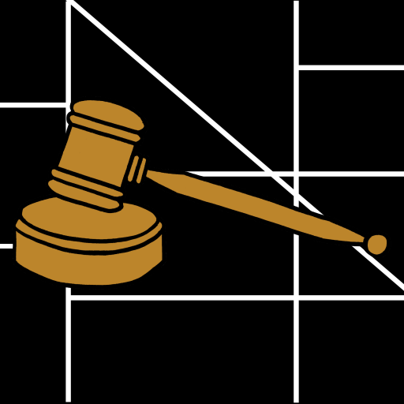
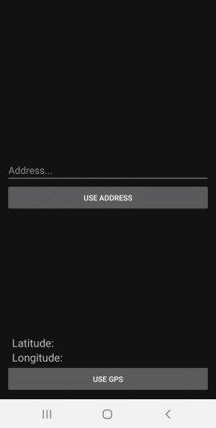
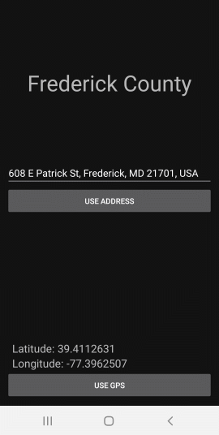
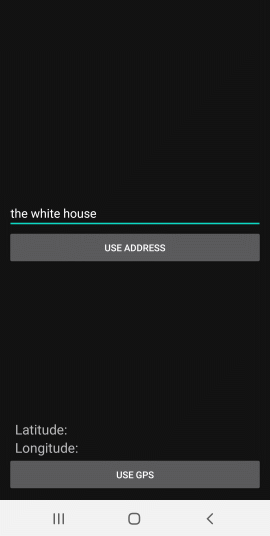
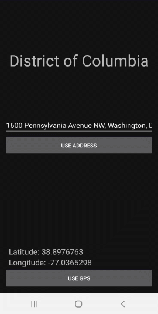

# Jurisdiction Finder

This Android app ([available for download on Google Play](https://play.google.com/store/apps/details?id=com.rsquared.jurisdictionfinder&hl=en&gl=US)) is designed to take a user's current location through their GPS coordinates or a manually entered address and yield the current legal jurisdiction (i.e.: county, incorporated city, township, etc).

## Table of Contents

- [Background](#background)
- [Install](#install)
- [Usage](#usage)
- [Contributing](#contributing)
- [License](#license)
- [Acknowledgements](#acknowledgments)

## Background

The original inspiration for this app came from the beginnings of a collaboration with James Sinclair, the creator of the website [Local Alcohol Laws](http://localalcohollaws.com/).  The idea was to use the location gathered from this app with the information from the **Local Alcohol Laws** database for a **Local Alcohol Laws** app, but the venture never took off and instead this app was created separately. 

## Install

Assuming you have Android Studio up and running, you can do the following to get a working environment up and running:

1. Open Android Studio
2. Go to `File` menu and then click `Close` if you have another project showing
3. Click `Get from Version Control`
4. Enter `https://github.com/rbrutherford3/Jurisdiction-Finder.git` into the `URL` field
5. Select a location on your hard drive to house the project under `Directory`
6. Click `Clone`

## Usage

Opening the downloaded app will reveal a blank input screen:

The user may either use their GPS or enter an address.  If the user presses the GPS button, the closest address will be displayed, along with the jurisdiction.

If the user may also enter a point of interest, as shown in the next screenshot.

Entering a point of interest will result in the GPS coordinates, address, and jurisdiction to be revealed.

## Contributing

Contributions are welcome, including any feedback.  Please contact rbrutherford3 on GitHub.

## License

[MIT © Robert Rutherford](../LICENSE)

## Acknowledgments

Thanks to James Sinclair for providing the motivation to create this app.